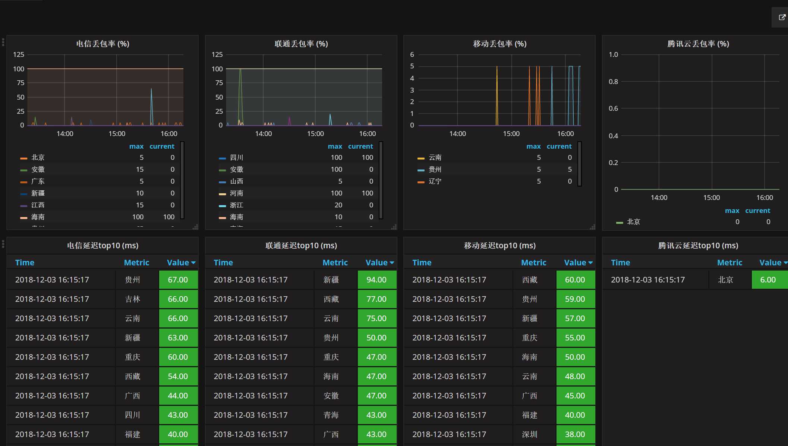
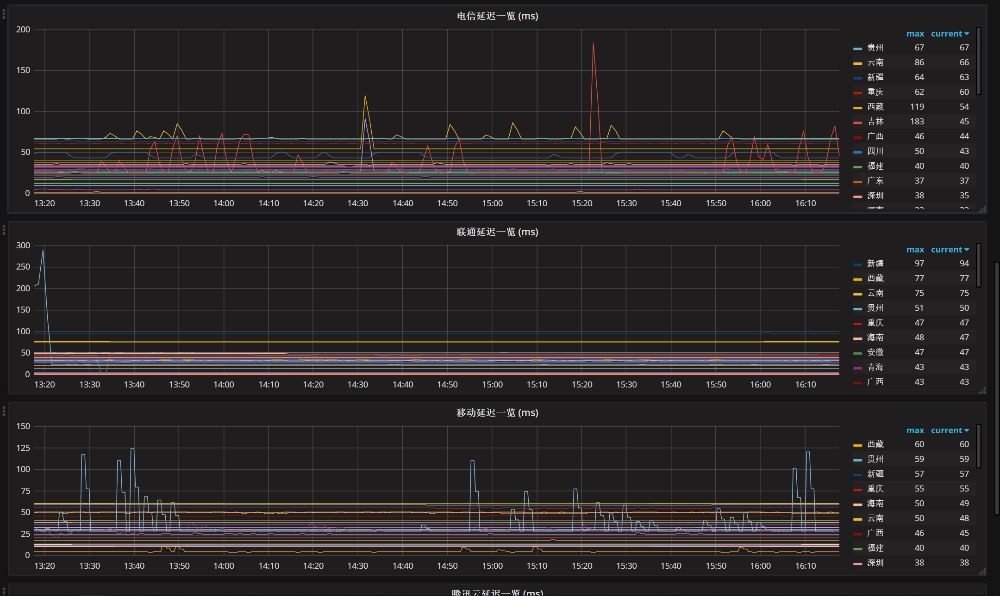

> 一、概述

IDC机房测速工具，由3个组件组成：  
smokeping：主要负责采集数据  
prometheus：主要负责存储数据  
grafana：主要负责展现数据  

测试环境: python2.7 pip  模块requests rrdtool 
> 二、使用

```
cd /tmp
git https://github.com/Spider-Zhong/idc_ping_monitor.git
```

>> （1）smokeping
安装：
```
cd /tmp && wget -N --no-check-certificate https://raw.githubusercontent.com/ILLKX/smokeping-onekey/master/smokeping.sh && bash smokeping.sh
```
smokeping的家目录：

```
smokeping_home_dir=/opt/smokeping
```

创建config文件，并且配置全国各区域ip监测点

```
cd $smokeping_home_dir/etc
cp -rf /tmp/idc_ping_monitor/smokeping/location/* ./
```
监测点主要由国内的三大运营商的IP站点组成，也可以自定义需要检测的站点，更多的ip地址，可以参考 <http://ip.yqie.com/china.aspx> 

启动：

```
bash /tmp/smokeping.sh
```


>> （2）安装prometheus pushgateway
```
curl -s https://packagecloud.io/install/repositories/prometheus-rpm/release/script.rpm.sh | sudo bash
yum -y install prometheus2 pushgateway
systemctl status prometheus
systemctl start prometheus
systemctl start pushgateway
firewall-cmd --zone=public --add-port=9090/tcp
firewall-cmd --zone=public --add-port=9091/tcp
```


配置prometheus.yml

```
vim /etc/prometheus/prometheus.yml

global:
  scrape_interval:     60s
  evaluation_interval: 60s
 
scrape_configs:
  - job_name: prometheus
    static_configs:
      - targets: ['localhost:9090']
        labels:
          instance: prometheus

  - job_name: pushgateway
    static_configs:
      - targets: ['localhost:9091']
        labels:
          instance: pushgateway

```

把smokeping采集的数据通过rrdtool读取之后，按照一定的格式推送到prometheus的gateway，时间间隔是1分钟
Ps: 请务必检查运行环境 模块是否安装  requests rrdtool
```
cp /tmp/idc_ping_monitor/prometheus/collection_to_prometheus.py $smokeping_home_dir
touch /tmp/smoking_pushgateway.log
```

在/usr/local/smokeping/collection_to_prometheus.py中，按照实际情况配置3个参数：  

```python
'LOG_FILE' : '/tmp/smoking_pushgateway.log'             # 日志文件  
'prometheus_gateway' : 'http://localhost:9091'     # Prometheus gateway地址  
'data_dir' : '/opt/smokeping/htdocs/data'                # smokeping rrd文件的存放地址  
```

配置crontab

```
crontab -e 

* * * * * python /opt/smokeping/collection_to_prometheus.py
```


>> （3）grafana

安装
```
wget https://dl.grafana.com/oss/release/grafana-6.1.6-1.x86_64.rpm 
sudo yum localinstall grafana-6.1.6-1.x86_64.rpm 
```

将模板grafana/ping_monitor.json 导入grafana即可，效果大概是这样



